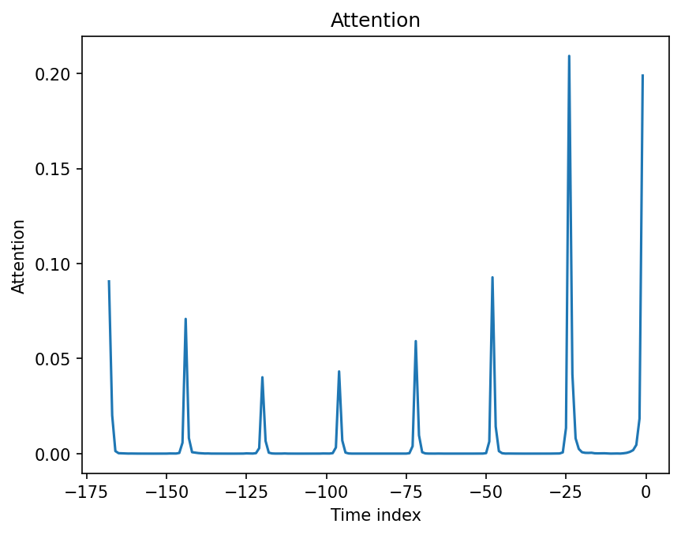
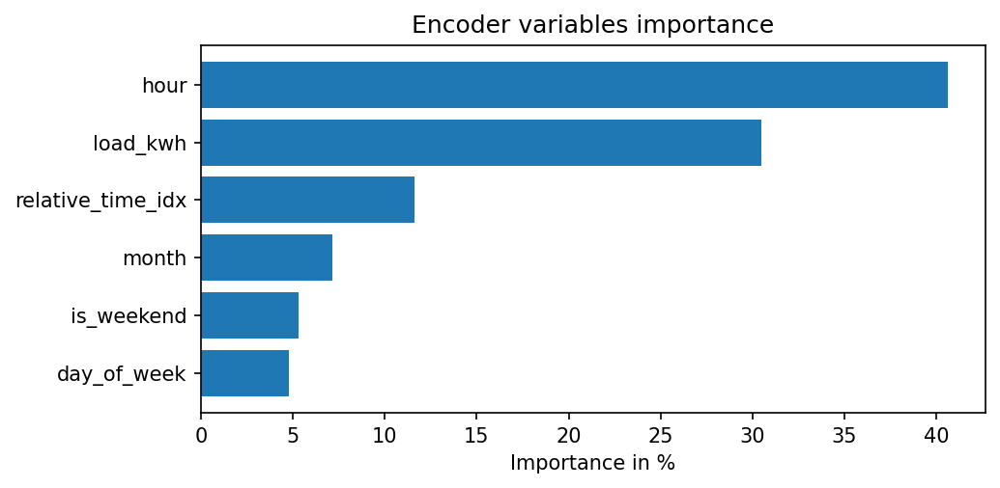
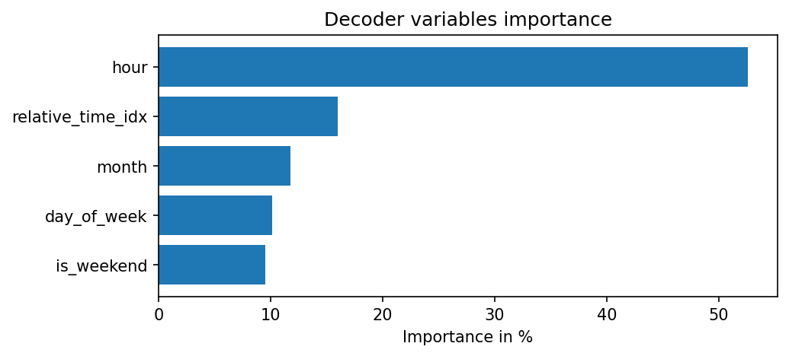
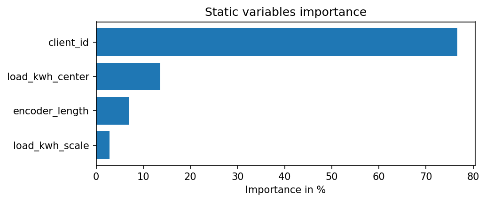
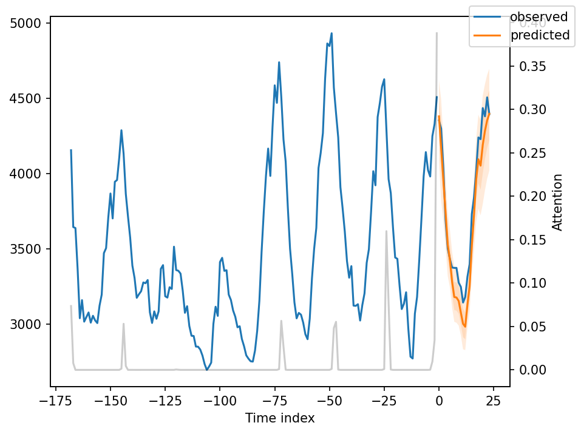
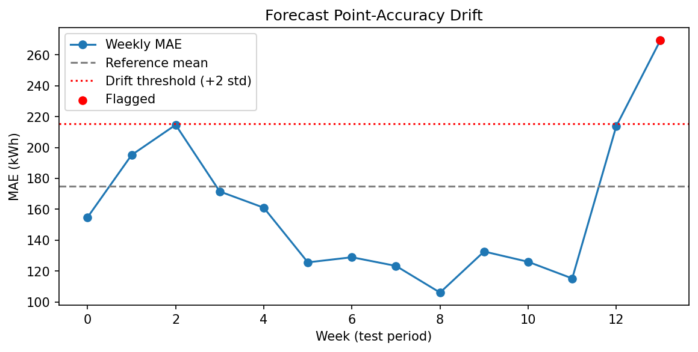
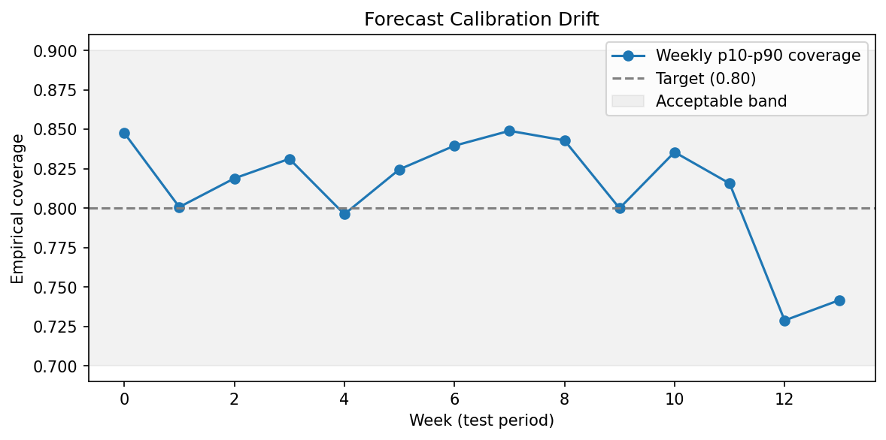

<div align="center">

# Multi-Horizon Electricity Load Forecasting with Temporal Fusion Transformer

Probabilistic 24-hour electricity load forecasting for 314 clients, comparing a
Temporal Fusion Transformer against seasonal-naive, LightGBM, and LSTM
baselines — with full model interpretability, forecast-drift monitoring, and
a deployed serving layer (FastAPI, Docker, Streamlit).


[](https://archive.ics.uci.edu/dataset/321/electricityloaddiagrams20112014)


</div>

---

## Overview

Given up to one week (168 hours) of historical hourly load, this project
forecasts the next 24 hours as **quantiles** (p10 / p25 / p50 / p75 / p90)
rather than a single point estimate — useful for capacity planning, where the
*range* of likely demand matters as much as the expected value.

Four models are trained and evaluated on identical data and identical
metrics, specifically to answer one question: **does the added architectural
complexity of a Temporal Fusion Transformer actually earn its keep over
simpler, cheaper baselines — and if so, on what axes?**

| Model | MAE | RMSE | SMAPE |
|---|---|---|---|
| Seasonal naive | 247.59 | 1658.38 | 13.74 |
| LightGBM (residual-based, regularized) | 225.66 | 2475.55 | 14.04 |
| LSTM seq2seq (per-client normalized) | 163.26 | 1332.62 | 9.17 |
| **Temporal Fusion Transformer** | **153.85** | **1302.58** | **8.26** |

TFT wins on every metric, and its p10–p90 quantile band achieves **0.817
empirical coverage** against a 0.80 target — meaning its uncertainty
estimates are genuinely calibrated, not just decorative. Full discussion
below.

---

## Dataset

[UCI Electricity Load Diagrams 2011–2014](https://archive.ics.uci.edu/dataset/321/electricityloaddiagrams20112014)
— 370 clients, 15-minute resolution, resampled to hourly kWh. 314 clients
retained after filtering for sufficiently complete history (≥95% non-zero
readings over the analysis window). Chronologically split into train (through
mid-2014), validation (Q3 2014), and test (Q4 2014) — no shuffling, no
leakage.

The raw file (~250MB) is not committed to this repo. Download it and run the
pipeline yourself:

```bash
python src/data_pipeline.py --raw_path data/raw/LD2011_2014.txt
```

---

## Approach

| Model | Role |
|---|---|
| Seasonal naive (t − 168h) | Exploits this dataset's strong weekly periodicity directly — a genuinely tough baseline to beat |
| LightGBM, direct multi-horizon | Trained on the **residual** against seasonal naive (not raw load), with client identity as a categorical feature, regularized and early-stopped against a held-out validation split |
| LSTM seq2seq | Encoder-decoder with learned per-client embeddings and **per-client z-score normalization** — no attention |
| **Temporal Fusion Transformer** | Variable selection networks, gated residual networks, interpretable multi-head attention, native quantile loss |

Each model exists to isolate a specific question:
- Does *any* machine learning beat a strong seasonal-naive baseline? (LightGBM)
- Does deep learning help once you've committed to a neural architecture, *before* adding attention? (LSTM)
- Does attention specifically add value on top of that? (TFT)

---

## Results

### Full comparison (test set, 24h horizon)

| Model | MAE | RMSE | SMAPE |
|---|---|---|---|
| Seasonal naive | 247.59 | **1658.38** | 13.74 |
| LightGBM (residual, regularized) | 225.66 | 2475.55 | 14.04 |
| LSTM seq2seq | 163.26 | 1332.62 | 9.17 |
| **TFT** | **153.85** | **1302.58** | **8.26** |

**TFT p10–p90 coverage: 0.817** (target ≈ 0.80) — confirms calibrated,
trustworthy uncertainty bands, not just point accuracy.

### What the numbers actually show

**Seasonal naive is a genuinely strong baseline.** This dataset's extreme
weekly periodicity means "copy last week's value at the same hour" is hard to
beat — a well-documented phenomenon in forecasting competitions, not a fluke
here.

**LightGBM's story is a real, nuanced finding, not a clean win.** A first
attempt (predicting raw kWh, pooled across 314 differently-scaled clients)
*lost* to seasonal naive on every metric. Two fixes were required:
1. **Reframing the target as a residual against seasonal naive** (rather than
   raw load) — this alone flipped MAE in LightGBM's favor, but RMSE got
   *worse*, revealing that the residual model was accurate on average but
   made occasional large, costly misses.
2. **Regularization + early stopping against a held-out validation split**
   (shallower trees, L1/L2 penalties, stopping before the model started
   fitting noise in the low-signal residual target) — this narrowed but did
   not close the RMSE gap.

The RMSE gap that survived both fixes points to a real, specific limitation:
**none of this project's calendar features include a holiday signal.** This
hypothesis, raised while diagnosing LightGBM, is independently confirmed
twice more later in this project (see Interpretability and Drift Monitoring).

**LSTM needed the same diagnosis LightGBM did — heterogeneous client scale —
but fixed differently.** An early run without normalization produced a loss
around 225 million (unusable); the fix was per-client z-score normalization
(computed from training data only, no leakage), which brought training to a
healthy, stable range and let the LSTM beat every prior model on every
metric, including the RMSE that LightGBM never fully solved.

**TFT improved on the LSTM across the board**, and its native quantile
output is the one thing none of the other three models can offer at all:
genuinely calibrated uncertainty, not just a point forecast.

---

## Interpretability

`notebooks/attention_interpretability.py` uses TFT's *native* interpretability
(attention weights and learned variable-selection gates — part of the
model's forward pass, not a post-hoc technique like SHAP) to inspect what the
trained model actually relies on.

**Findings, from the real trained model:**

- **Attention peaks sharply at ~24-hour intervals** in the lookback window
  (−168h, −144h, ... −24h, 0h), strongest at "yesterday, same hour" and "right
  now." The model discovered daily periodicity **on its own**, with no
  explicit seasonal feature — directly corroborating the `lag_24`/`lag_168`
  features hand-engineered for the LightGBM baseline.

  

- **`hour` is the single most influential variable** in both the encoder
  (~40%, ahead of raw load itself) and decoder (~53%) — consistent with the
  attention pattern, since knowing the hour is what lets the model align
  "yesterday at this same time."

  | Encoder variables | Decoder variables |
  |---|---|
  |  |  |

- **`client_id` dominates static variable importance (~77%)** — independently
  confirming, for the third time in this project, why adding client identity
  as a categorical feature fixed LightGBM's RMSE problem and why the LSTM's
  client embedding was necessary. Three different model families converged
  on the same conclusion through three different mechanisms.

  

**Single-sample deep dive** — one client's forecast plotted alongside the
attention weights that produced it (gray, right axis):



---

## Drift Monitoring

`src/drift_monitoring.py` tracks two signals across the test period that a
point-estimate model (LightGBM, LSTM) cannot even be checked for:

1. **Point-accuracy drift** — rolling weekly MAE against a reference band
   (mean ± 2 std from the earliest test weeks)
2. **Calibration drift** — rolling weekly p10–p90 coverage against the 0.80
   target, since a probabilistic model can quietly become miscalibrated even
   while point accuracy looks fine

A third signal (PSI + Kolmogorov-Smirnov test on the target distribution
itself, first vs. last weeks of the test period) checks whether the
underlying demand pattern shifted over the window.

**Result:** weeks 5–11 perform excellently (MAE well below the reference
baseline). **Weeks 12–13 — Christmas and New Year's — show a sharp,
simultaneous breakdown in both point accuracy (MAE nearly doubles, crossing
the drift threshold) and calibration (coverage drops from ~0.80–0.85 to
~0.73–0.74).** This is the same missing-holiday-signal limitation identified
independently during LightGBM diagnosis and again during interpretability
analysis — now confirmed with dated, quantitative evidence from a third,
independent angle.

| Point-accuracy drift | Calibration drift |
|---|---|
|  |  |

---

## Deployment

The trained model is served two ways, both built on a shared core
(`src/forecasting_service.py`) so the tricky logic lives in exactly one
place:

- **FastAPI** (`src/api.py`) — REST endpoints (`/health`, `/clients`,
  `/forecast/{client_id}`), containerized with **Docker**
- **Streamlit** (`src/streamlit_app.py`) — interactive fan-chart demo with a
  client selector and live quantile visualization

Since the full 314-client dataset and trained model weights aren't committed
to git, the demo serves a small bundled sample of 8 representative clients
(`demo/sample_data.parquet`), and the model checkpoint is hosted on
**Hugging Face Hub** (`src/upload_to_hf.py`) with an automatic download
fallback in `forecasting_service.py` for environments (like a fresh cloud
deploy) where it isn't present locally.

```bash
# one-time setup
python -m src.export_serving_artifacts --config config.yaml
python -m src.upload_to_hf --repo_id yourusername/tft-electricity-forecasting

# FastAPI + Docker
docker build -t tft-forecast-api .
docker run -p 8000:8000 tft-forecast-api
# → http://localhost:8000/docs

# Streamlit
streamlit run src/streamlit_app.py
```

### Getting this running was a real debugging exercise

Serving a GPU-trained checkpoint from a CPU-only environment surfaced a chain
of genuinely non-obvious problems, each requiring a different fix:

- **Windows path-length limits** during PyTorch's CUDA-build install (fixed
  via the `LongPathsEnabled` registry key and moving the project out of a
  deeply-nested OneDrive folder)
- **A corrupted, partial CUDA dependency install** inside Docker, traced to
  the default PyPI `torch` wheel silently pulling the full CUDA stack even
  though the container has no GPU — fixed by explicitly targeting PyTorch's
  CPU-only wheel index
- **Docker Desktop DNS/networking failures**, unrelated to any code, resolved
  through a full engine restart and WSL2 reset
- **A checkpoint device-mismatch bug**: loading a GPU-trained model into a
  CPU-only container failed even with `map_location="cpu"`, because
  `torchmetrics` objects (the loss function, logging metrics) cache a
  private `_device` attribute at instantiation time — a plain Python
  attribute, not a tensor, so it silently survives `state_dict` remapping
  and still points at `cuda:0`. The fix: bypass the framework's automatic
  checkpoint loader entirely, rebuild the model from its raw state dict, and
  generically reset `_device` on every submodule that has one.

---

## Repo structure

```
├── data/
│ ├── raw/                                  # place LD2011_2014.txt here (gitignored)
│ └── processed/                            # generated by data_pipeline.py (gitignored)
├── demo/
│ └── sample_data.parquet                   # small, committed sample for the live demo
├── src/
│ ├── data_pipeline.py                      # load, resample, chronological split
│ ├── metrics.py                            # MAE/RMSE/SMAPE, pinball loss, quantile coverage
│ ├── baselines.py                          # seasonal naive, residual-based LightGBM
│ ├── evaluate_baselines.py                 # trains + evaluates both, saves results
│ ├── lstm_baseline.py                      # LSTM seq2seq with per-client normalization
│ ├── tft_model.py                          # TFT training + evaluation (pytorch-forecasting)
│ ├── drift_monitoring.py                   # point-accuracy + calibration drift over time
│ ├── export_serving_artifacts.py           # exports the schema + demo sample for serving
│ ├── forecasting_service.py                # shared inference logic (API + Streamlit)
│ ├── api.py                                # FastAPI serving layer
│ ├── streamlit_app.py                      # interactive fan-chart demo
│ ├── upload_to_hf.py                       # publishes trained model to Hugging Face Hub
│ └── requirements.txt                      # CPU-only deps for Streamlit Cloud deployment
├── notebooks/
│ └── attention_interpretability.py         # TFT attention + variable-importance analysis
├── models/                                 # trained checkpoints (gitignored — see Deployment)
├── reports/
│ ├── figures/                              # interpretability + drift plots
│ ├── baseline_results.json
│ └── drift_weekly_report.csv
├── tests/
│ └── test_metrics.py
├── .github/workflows/tests.yml             # CI: runs the test suite on every push
├── config.yaml
├── pytest.ini
├── requirements.txt                        # local/Docker deps (CUDA torch pinned)
├── Dockerfile
├── .dockerignore
├── .gitignore
└── LICENSE
```

---

## Setup

```bash
python -m venv venv && source venv/bin/activate      # Windows: venv\Scripts\Activate.ps1

# Install torch matching your CUDA version FIRST — see requirements.txt for details
pip install torch==2.13.0+cu126 --index-url https://download.pytorch.org/whl/cu126  # adjust for your GPU

pip install -r requirements.txt

# Download LD2011_2014.txt from the UCI link above into data/raw/, then:
python src/data_pipeline.py --raw_path data/raw/LD2011_2014.txt
```

Run the test suite:
```bash
pytest tests/ -v
```

---

## Status

- [x] Data pipeline (load, resample, filter, chronological split)
- [x] Metrics module (point + probabilistic)
- [x] Seasonal naive + LightGBM baselines
- [x] LSTM seq2seq baseline (per-client normalized)
- [x] TFT training pipeline
- [x] Attention-weight interpretability
- [x] Forecast-drift monitoring
- [x] FastAPI serving + Docker
- [x] Streamlit demo
- [x] CI (GitHub Actions)
- [ ] Public cloud deployment (optional — works fully locally; see Deployment)

---

## Reference

Lim, B., Arık, S. Ö., Loeff, N., & Pfister, T. (2021). Temporal Fusion
Transformers for interpretable multi-horizon time series forecasting.
*International Journal of Forecasting*, 37(4), 1748–1764.

---

## License

This project is licensed under the MIT License — see [LICENSE](LICENSE) for details.